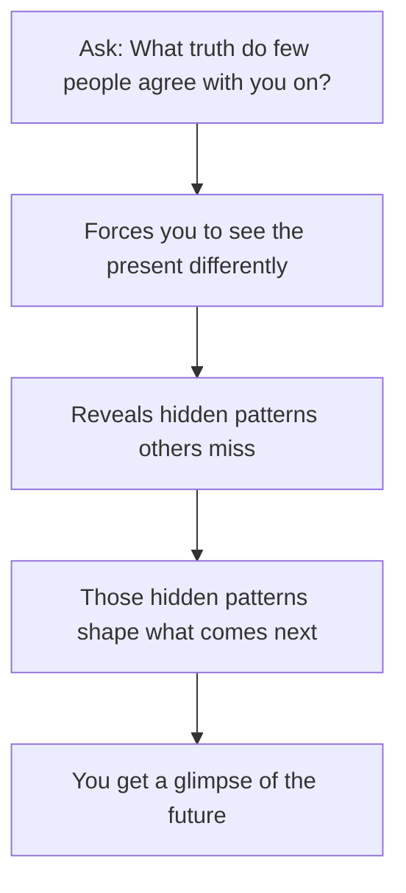
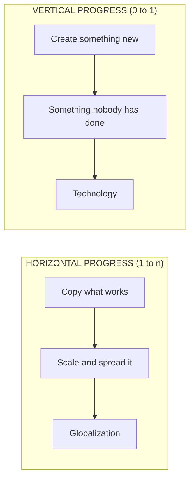
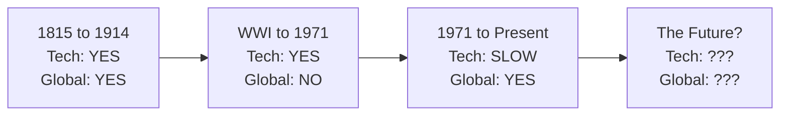
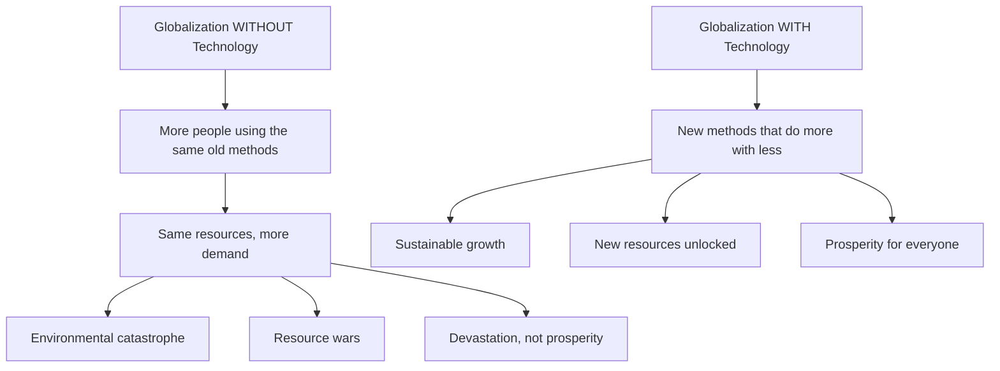
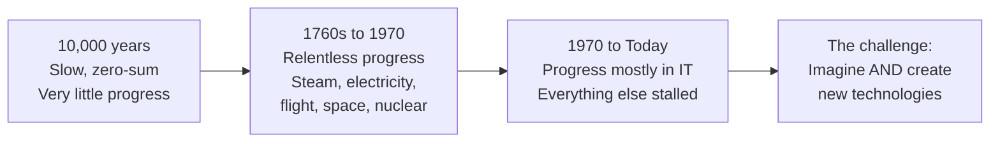
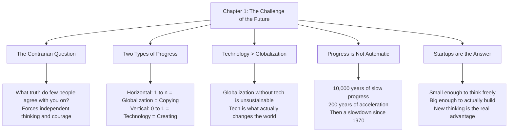

# Chapter 1: The Challenge of the Future

## The Big Idea in One Line

The future belongs to people who create **new things** (going from 0 to 1), not to people who copy what already exists (going from 1 to n).

---

## Peter Thiel's Favourite Interview Question

Whenever Thiel interviews someone for a job, he asks them this:

> **"What important truth do very few people agree with you on?"**

At first glance, this seems like an easy question. It is not. It is actually one of the hardest questions you can be asked, and here is why:

**The intellectual trap:** Everything you learned in school is, by definition, stuff that everyone already agrees on. Your teachers taught you things that are accepted as true by society. So where do you even begin to find a truth that *most people get wrong*?

**The courage trap:** Even if you do find such a truth, saying it out loud means telling people something unpopular. And most people would rather stay quiet than be the weird one in the room. Thiel puts it beautifully: "Brilliant thinking is rare, but courage is in even shorter supply than genius."

### The Anatomy of a Bad Answer

Thiel gives us three examples of answers people commonly give:

| Bad Answer | Why It Fails |
|---|---|
| "Our educational system is broken." | Tons of people already believe this. It is not contrarian at all. |
| "America is exceptional." | Same problem. This is a mainstream opinion, not a hidden truth. |
| "There is no God." | This just picks a side in a debate that has been raging for centuries. Nothing new here. |

The pattern? These answers feel bold, but they are actually just **popular opinions dressed up as brave thinking**. It is like wearing a leather jacket to look rebellious while following every rule in the book.

### The Anatomy of a Good Answer

A truly good answer follows this structure:

> "Most people believe in X, but the truth is the opposite of X."

Think of it like this. Imagine everyone in a room is looking at a painting and seeing a dog. A good contrarian answer is not "I see a cat instead of a dog." That is just being different for the sake of it. A good answer is "Everyone sees a dog, but if you look closely at the brushstrokes and the artist's history, it is actually a wolf, and here is why that matters."

The answer has to be **genuinely surprising**, **defensible with evidence**, and **meaningful** in its implications.

---

## Why This Question Matters for the Future

Thiel is not asking this question just to be clever at dinner parties. He connects it directly to the future:

- The future is not simply "the collection of days that have not happened yet." What makes the future special is that it will be a time **when the world looks different from today**.
- If absolutely nothing about our society changes for the next 100 years, then the future is effectively 100+ years away. But if radical change happens in the next decade, the future is basically here.
- We know two things for certain about the future: it **will** be different from today, and it **must** grow out of the world we live in right now.

Here is the connection: **answers to the contrarian question are really just different ways of seeing the present more clearly.** And the best answers are the closest thing we have to a crystal ball.

Think of it like being a weather forecaster. You cannot predict the exact weather in 10 years. But if you understand today's atmospheric patterns better than anyone else, you are the best-equipped person to make sense of what is coming.

---

## The Two Types of Progress

This is the single most important framework in the entire book. Every chapter builds on it.

### Horizontal Progress: Going from 1 to n

**What it means:** Taking something that already works and copying it. Scaling it. Spreading it around.

**The analogy:** Imagine someone bakes an incredible chocolate cake. Horizontal progress is opening 100 bakeries that all sell that exact same cake. You are not inventing anything new. You are multiplying something that already exists.

**Examples:**
- Building 100 typewriters when you already have a working typewriter design
- A country copying another country's railroad system
- Opening a new McDonald's franchise in a new city
- China replicating Western infrastructure (railroads, air conditioning, entire cities)

**The single word for horizontal progress at the global scale is: GLOBALIZATION.** It means taking things that work somewhere and making them work everywhere.

China is Thiel's go-to example. Their 20-year plan was essentially: "become like the United States is today." They have been copying everything that worked in the developed world. Sometimes they skip steps (going straight to wireless phones without ever building landline networks), but the fundamental approach is the same: copy, adapt, deploy.

### Vertical Progress: Going from 0 to 1

**What it means:** Creating something entirely new. Doing something that has never been done before.

**The analogy:** Going back to our cake. Vertical progress is not baking more cakes. It is inventing the microwave oven. It is creating an entirely new way of heating food that nobody had ever imagined before. The world before your invention and the world after it are fundamentally different places.

**Examples:**
- Having a typewriter and inventing the word processor
- Inventing the smartphone
- Discovering antibiotics
- Creating the internet

**The single word for vertical progress is: TECHNOLOGY.** And here is a critical nuance that Thiel emphasizes: technology does not just mean computers. Properly understood, any new and better way of doing things is technology. A new farming technique is technology. A new way to desalinate water is technology. A new organizational structure is technology. We have been trained to think "technology = Silicon Valley gadgets," but that is far too narrow.

### Side-by-Side Comparison

| | Horizontal (1 to n) | Vertical (0 to 1) |
|---|---|---|
| **What you do** | Copy things that work | Create entirely new things |
| **Difficulty** | Easier to imagine (we know what it looks like) | Harder to imagine (nobody has seen it yet) |
| **Macro-level word** | Globalization | Technology |
| **Example** | Building 100 typewriters | Inventing the word processor |
| **Risk level** | Lower (proven model) | Higher (uncharted territory) |
| **Who typically does it** | Big companies, developing nations | Startups, inventors, visionaries |

---

## Can You Have One Without the Other?

Yes! Globalization and technology are **independent variables**. You can have both, either, or neither at the same time. Thiel walks through history to prove this:

| Time Period | Technology? | Globalization? | What Happened |
|---|---|---|---|
| **1815 to 1914** | Yes, rapid | Yes, rapid | Both booming together. Steam engines, railroads, telegraph, and massive global trade expansion. |
| **World War I to 1971** | Yes, rapid | No, not much | Wars and political barriers shut down global trade, but technology kept advancing (nuclear energy, space travel, computers). |
| **1971 to present** | Limited (mostly just IT) | Yes, rapid | The world became hyper-connected, but actual technological breakthroughs slowed down. We got iPhones but not flying cars. |

This historical pattern is important because it smashes the assumption that technology and globalization always move together. They don't.

---

## Thiel's Own Contrarian Answer

Now Thiel gives us his personal answer to his own question:

> **"Most people think the future of the world will be defined by globalization, but the truth is that technology matters more."**

This is not just a philosophical opinion. Thiel backs it up with hard logic:

### The Sustainability Argument

Think of the planet like a shared apartment. Globalization without technology is like having more and more roommates move in, all using the same old appliances, the same old plumbing, the same old everything. Eventually the electricity bill goes through the roof, the water pressure drops to nothing, and the place becomes unlivable.

Thiel's specific examples:

- **China:** If it doubles its energy production over the next two decades using existing technology, it will also double its air pollution. Copy-paste progress creates copy-paste problems.
- **India:** If hundreds of millions of Indian households started living exactly the way Americans live today, using only today's tools, the environmental result would be catastrophic.

**The bottom line:** Spreading old ways to create wealth around the world will result in devastation, not riches. In a world of scarce resources, **globalization without new technology is unsustainable.**

---

## Technology is Not Automatic: A Brief History of Progress

One of the most sobering parts of this chapter is Thiel's reminder that technological progress is **not guaranteed**. It does not just happen on its own like the seasons changing. It requires deliberate, difficult, courageous work.

### The Long Drought (Prehistory to 1760s)

- For roughly **10,000 years**, our ancestors lived in what Thiel calls "static, zero-sum societies."
- "Zero-sum" means that for one person to win, another had to lose. Think of it like a poker table: the total amount of money on the table never changes, it just moves from one player to another. Success meant **taking from others**, not creating something new.
- Progress was painfully slow: primitive agriculture, then medieval windmills, then 16th-century astrolabes. That is 10,000 years and barely anything to show for it.

### The Great Acceleration (1760s to 1970)

- Then something extraordinary happened. Starting with the steam engine in the 1760s, the world experienced roughly **200 years of relentless technological progress**.
- The result: we inherited a society richer than any previous generation could have imagined.
- By the late 1960s, people fully expected this to continue. They dreamed of:
  - Four-day workweeks
  - Energy too cheap to meter
  - Vacations on the moon

### The Slowdown (1970 to Today)

- **But it did not happen.** Progress stalled in most areas.
- Only **computers and communications** have improved dramatically since midcentury. Everything else (energy, transportation, medicine, space travel, infrastructure) has been largely stagnant.
- Thiel has a brilliant observation here: "The smartphones that distract us from our surroundings also distract us from the fact that our surroundings are strangely old."

Think about that. Your phone is a miracle of technology. But look up from it. The roads, the buildings, the airports, the trains, the energy grid... much of it would look familiar to someone from 1970. We have been **so dazzled by digital progress** that we failed to notice how little progress we have made everywhere else.

### The Critical Lesson

> Our parents and grandparents were not wrong to imagine a better future. They were only wrong to **expect it as something automatic.**

Today's challenge is to **both imagine and create** the new technologies that can make the 21st century more peaceful and prosperous than the 20th. It will not happen by itself. Someone has to do it.

---

## Why Startups? The Case for Small Teams

If new technology is so important, who is going to build it? Thiel's answer: **startups**.

### Why Not Big Companies?

Big organizations have three problems when it comes to creating new things:

1. **Bureaucratic hierarchies move slowly.** Decisions go through 14 layers of approval. By the time the memo reaches someone who can actually do something, the opportunity has passed.

2. **Entrenched interests shy away from risk.** The people running a big company have something to lose. They have salaries, bonuses, corner offices. Why would they bet all of that on something unproven and risky?

3. **Signaling replaces substance.** In the most dysfunctional organizations, looking like you are doing work becomes a better career strategy than actually doing work. Writing impressive reports about innovation becomes more rewarded than actually innovating. (Thiel's advice: "If this describes your company, you should quit now.")

Think of a big company like an aircraft carrier. It is powerful, but try making a sharp turn. It takes miles to change direction. And every officer on board has a vested interest in keeping the ship going exactly where it is already headed.

### Why Not Lone Geniuses?

Going to the other extreme does not work either. A lone genius might paint a masterpiece or write a great novel, but **one person cannot create an entire industry.** You need other people to build, test, sell, distribute, and improve.

Think of a lone genius like a person trying to build a house by themselves. Sure, they might be the world's greatest architect. But they also need to be the electrician, the plumber, the carpenter, the roofer, and the inspector. At some point, you need a team.

### The Startup Sweet Spot

Startups sit in the sweet spot between these two extremes:

Startups operate on a simple principle: **you need to work with other people to get stuff done, but you also need to stay small enough so that you actually can.**

### Thiel's Definition of a Startup

> **"A startup is the largest group of people you can convince of a plan to build a different future."**

This is a beautiful definition because it captures three things at once:
- **Size constraint:** it has to be small enough that everyone shares the same vision
- **Conviction requirement:** everyone must genuinely believe in the plan
- **Ambition requirement:** the goal must be to build something genuinely different, not to copy what already exists

### Why Small Size is the Superpower

A new company's most important strength is **new thinking.** Thiel says that even more important than being nimble or fast-moving, **small size affords space to think.**

This is counterintuitive. We tend to think of startups as being valuable because they are fast. Thiel is saying that speed is secondary. The real advantage is **cognitive freedom.** When you are small, you can question everything. You can look at an industry and ask, "Why does everyone do it this way? What if the entire approach is wrong?"

The entire book, Thiel tells us, is not a manual. It is not a recipe. It is **an exercise in thinking.** Because that is what a startup has to do: **question received ideas and rethink business from scratch.**

---

## Key Takeaways: The Chapter in a Nutshell

1. **The contrarian question is the foundation of innovation.** If you cannot identify a truth that most people get wrong, you are not ready to build something new. Finding these truths requires both intellectual ability and, more importantly, courage.

2. **Understand the two types of progress.** Horizontal progress (1 to n) is copying and scaling what works. Vertical progress (0 to 1) is creating something entirely new. The world needs both, but vertical progress is what truly changes things.

3. **Technology is more important than globalization.** Without new technology, spreading existing ways of doing things to more people will exhaust the planet's resources. Technology creates new possibilities. Globalization only distributes existing ones.

4. **Do not assume progress will happen on its own.** For most of human history, it did not. The 200-year burst from the 1760s to 1970 was the exception, not the rule. And since 1970, progress has slowed dramatically outside of computing.

5. **Startups are the engine of 0-to-1 progress.** They combine the cognitive freedom of a small group with the collaborative power needed to build real things. Big companies are too slow and risk-averse. Lone geniuses cannot execute at scale.

6. **The most important thing a startup has is not speed. It is the ability to think.** Small size gives you the room to question everything and rethink business from first principles.
