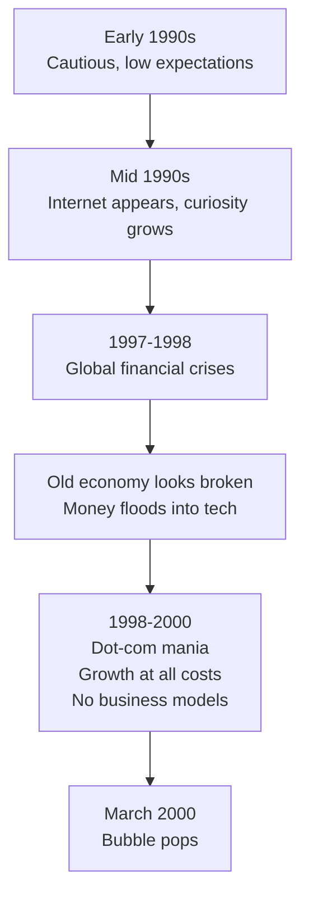
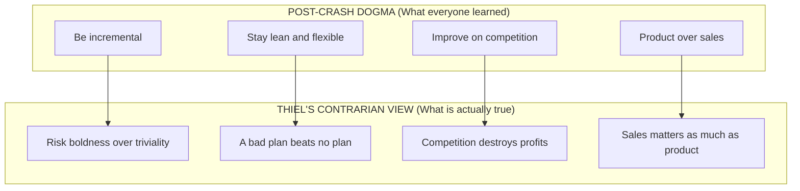
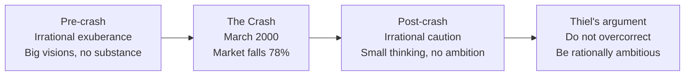
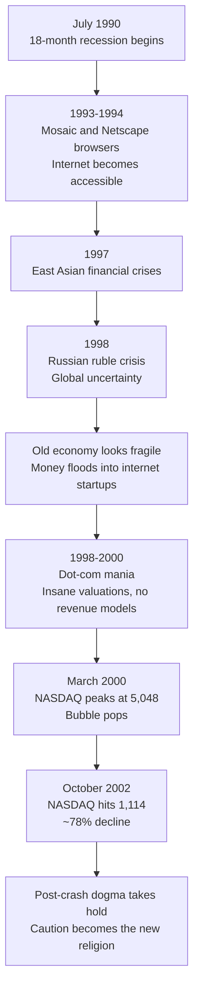

# Chapter 2: Party Like It's 1999

## The Big Idea in One Line

The dot-com crash of 2000 taught Silicon Valley a set of lessons that became gospel. Most of those lessons are **wrong**, and blindly following them makes you just as irrational as the people who caused the bubble in the first place.

---

## Setting the Stage: The Contrarian Question Revisited

Chapter 1 introduced the contrarian question: "What important truth do very few people agree with you on?" Chapter 2 reframes this as a more practical version:

> **"What does everybody agree on?"**

Thiel argues that it is sometimes easier to start by identifying what everyone believes, and then ask whether those beliefs are actually correct. As Nietzsche put it: "Madness is rare in individuals, but in groups, parties, nations, and ages it is the rule."

Think of it like trying to spot a fish in water. The fish does not know it is in water because the water is everywhere. Similarly, we do not notice popular delusions because everyone around us shares them. The trick is to step outside the fishbowl and look at the water itself.

This chapter tells the story of the biggest recent example of collective madness in business: the 1990s dot-com bubble. And more importantly, it dissects the **wrong lessons** that people learned from the crash.

---

## A Short History of the 1990s

Thiel walks us through the decade in stages, showing how rational optimism slowly curdled into irrational exuberance.

### The Backdrop: A World of Low Expectations (1991 to 1996)

The early 1990s were not a great time for confidence:

- The economy was in a slump after an 18-month recession in July 1990.
- Recovery was slow and jobless. Manufacturing employment continued to decline.
- The U.S. had just helped win the Cold War, but it was not clear what to do next.
- The internet was not yet on most people's radar.

The mood was cautious. People were not thinking about getting rich. They were thinking about not falling behind.

Then, slowly, things started to change. The internet went from being a curiosity used by academics and military researchers to a tool that ordinary people could access. The Mosaic web browser launched in 1993. Netscape followed in 1994. People started to glimpse the possibilities.

### The Slow Build: A Short Dot-Com Mania (1998 to 1999)

Between the fall of 1998 and March 2000, Silicon Valley experienced a mania. The shift happened rapidly:

- The East Asian financial crises of 1997 hit. The Russian ruble crisis followed in 1998. Global financial markets looked shaky.
- The only place that seemed to be working was the internet economy. Money started flooding into tech.
- Everyone suddenly agreed on one thing: **the old economy could not handle the challenges of globalization. The future was in technology, specifically the internet.**

This was not entirely crazy. The underlying observation was correct: the internet really was transformative. The problem was that the enthusiasm outran the reality. People were pouring money into companies that had no real business model, no revenue, and often no product.

Think of it like a gold rush. There really is gold in the hills. That part is true. But when everyone runs to the hills at the same time, most of them end up with nothing but muddy boots and empty pockets. The existence of gold does not mean that every person digging will find it.

### The Mania Gets Crazy

Thiel describes the insanity of the period through specific examples:

- Companies would spend millions on Super Bowl ads before they had any paying customers.
- The business plan of many startups was essentially: "get big fast," with no thought given to how to actually make money.
- Some companies had no product at all, just a website and a press release.

The operating assumption was: **growth first, revenue later (or maybe never).** People were not investing in businesses. They were placing bets on the idea that the internet itself would make everything valuable.

---

## PayPal in the Bubble

Thiel does not just tell this story from the outside. He was right in the middle of it. He was running PayPal during the mania, and he shares a remarkable inside perspective.

### PayPal's Origin Story

PayPal's original vision was audacious: **create a new internet currency to replace the U.S. dollar.** This was not a modest plan. It was a direct challenge to one of the most powerful institutions on Earth (the U.S. government and its monetary system).

When they realized that the full vision was too ambitious for the near term, they scaled back to a more practical goal: building a system that let people send and receive payments via email. This turned out to be exactly what eBay's growing community of online sellers needed.

### Thiel Knew the Bubble Was Real

Here is the most fascinating part. Thiel admits that he **knew** the dot-com environment was a bubble. He could see the signs of mania everywhere. But he also knew something else: **PayPal's mission was real and important.** The world genuinely needed a better payments system.

The tricky part was that PayPal needed to grow fast, and to do that, it needed money. And the bubble was the only source of easy money. So Thiel made a calculated decision: **raise as much money as possible before the bubble popped.**

Think of it like being on a ship that you know is going to hit an iceberg. You cannot stop the ship. But you can grab a lifeboat and fill it with supplies before impact. That is essentially what Thiel did. He raised $100 million in early 2000, just weeks before the crash. When the market collapsed, PayPal had the cash reserves to survive while hundreds of other startups went under.

> **Key Insight**: The fact that a bubble exists does not mean everything inside it is worthless. PayPal was a real company solving a real problem. The bubble just meant that the *timing and environment* were irrational, not that every individual company within it was irrational.

---

## The Crash: March 2000

The NASDAQ peaked at 5,048 in March 2000. Then it fell. And fell. And kept falling. By October 2002, it had dropped to 1,114. That is a decline of nearly 78%.

The crash was devastating:

- Trillions of dollars in market value evaporated.
- Hundreds of startups went bankrupt almost overnight.
- Many people who had quit stable jobs to join startups were suddenly unemployed.
- Silicon Valley went from being the center of the universe to being a cautionary tale.

The mood swung from wild optimism to deep pessimism. And in the wreckage, people tried to figure out what went wrong. They came up with a set of lessons. And according to Thiel, **most of those lessons were the wrong ones.**

---

## The Four "Lessons" Everyone Learned (And Why They Are Wrong)

This is the core of the chapter. After the crash, the startup world collectively adopted four principles as gospel truth. Thiel lays them out clearly, then flips each one on its head.

### Lesson 1: "Make incremental advances"

**What people learned:** Grand visions caused the bubble. Ambitious founders overpromised and underdelivered. Therefore, the safe path is to make small, incremental improvements. Do not try to change the world. Just try to be slightly better than what already exists.

**Why Thiel says this is wrong:** Small, cautious steps are actually a recipe for mediocrity. If everyone is making tiny improvements, nobody is making breakthroughs. The world needs big leaps, not baby steps.

**The analogy:** Imagine you are lost in a forest. The "incremental advance" approach says: take one small step forward, check your surroundings, take another small step. That sounds safe. But if the forest is huge and you do not have a compass, small steps will keep you wandering in circles forever. Sometimes you need to climb a tree, get a view of the whole landscape, and then make a bold move in a clear direction.

### Lesson 2: "Stay lean and flexible"

**What people learned:** Startups that made elaborate plans were the ones that crashed hardest. Big plans are arrogant. Instead, stay lean, stay flexible, "iterate," and treat entrepreneurship as an experiment. Do not commit to any specific vision. Just try things and see what works.

**Why Thiel says this is wrong:** "Lean" and "flexible" can easily become code words for "aimless" and "unserious." Treating your startup as an experiment means you are not really committed to any particular outcome. And if you are not committed, you will never build anything great.

**The analogy:** Imagine a basketball team that refuses to run set plays. "We will just stay flexible and react to whatever happens," the coach says. That might work for a pickup game in the park, but it will get destroyed by any team that has a real strategy. In business, as in basketball, flexibility without a plan is just chaos with extra steps.

### Lesson 3: "Improve on the competition"

**What people learned:** Do not try to create entirely new markets. That is too risky. Instead, find an existing market that is already proven, and build a slightly better product. Let someone else take the risk of proving that the market exists.

**Why Thiel says this is wrong:** If you start by defining yourself in relation to the competition, you are already thinking in terms of 1 to n (horizontal progress), not 0 to 1 (vertical progress). You are copying, not creating. The most valuable companies did not improve on existing products. They created entirely new categories.

**The analogy:** It is like entering a cooking competition and deciding to make the same dish as the reigning champion, but "a little bit better." Maybe you will win. But the person who invents an entirely new dish that the judges have never tasted before? They are playing a completely different game, and they are the ones who change the industry.

### Lesson 4: "Focus on product, not sales"

**What people learned:** The bubble was fueled by hype and marketing. Companies spent millions on ads for products that did not work. Therefore, the real lesson is: focus on building a great product. If the product is good enough, it will sell itself. If you need salespeople, your product is not good enough.

**Why Thiel says this is wrong:** Distribution and sales are just as important as the product itself. A great product that nobody knows about will fail. Silicon Valley has a cultural bias against salespeople, but that does not mean sales is unimportant. It means the industry has a blind spot.

**The analogy:** Think of a brilliant musician who writes incredible songs but refuses to perform live, refuses to go on social media, and refuses to work with a record label because "the music should speak for itself." Maybe the music is amazing. But if nobody hears it, does it matter?

---

## Side-by-Side: The Dogma vs. Thiel's Contrarian View

| # | Post-Crash Dogma | Thiel's Counter-Argument |
|---|---|---|
| 1 | Make incremental advances | It is better to **risk boldness than triviality** |
| 2 | Stay lean and flexible | A **bad plan is better than no plan** |
| 3 | Improve on the competition | **Competitive markets destroy profits** |
| 4 | Focus on product, not sales | **Sales matters just as much as product** |

---

## The Deeper Point: Do Not Learn the Wrong Lessons

This is where Thiel gets philosophical. He is not simply saying "the crash was fine" or "the bubble was good." He is making a much subtler argument:

### The Bubble Was a Time of Both Insanity and Clarity

- **The insanity:** Valuations were absurd. Business models were nonexistent. People were investing in nonsense.
- **The clarity:** People genuinely understood that the internet would transform the world. They understood that we needed new technology. They looked far into the future and saw how much valuable technology we would need to get there safely.

The bubble was like a broken clock. It was right about the big picture (the internet matters, technology is the future), but completely wrong about the details (which companies, which business models, which timelines).

### The Crash Created an Overcorrection

When the bubble popped, people reacted by swinging to the opposite extreme. If boldness caused the crash, then be cautious. If plans failed, then do not plan. If big visions were delusional, then think small.

But this overcorrection is just as irrational as the original bubble. You have replaced one form of groupthink with another. Instead of everyone being irrationally optimistic, everyone became irrationally cautious.

### The Most Contrarian Thing of All

Thiel ends the chapter with one of the most important lines in the entire book:

> **"The most contrarian thing of all is not to oppose the crowd but to think for yourself."**

This is a crucial distinction. Being contrarian does not mean automatically doing the opposite of what everyone else does. That is just inverted conformity. True contrarianism means **ignoring the crowd entirely and thinking from first principles.**

Think of it this way. If everyone is running east, the fake contrarian runs west. But the real contrarian stops, looks at a map, figures out where they actually need to go, and then walks in that direction, regardless of whether it is east, west, north, or south.

**The analogy of the pendulum:** Popular opinion swings back and forth like a pendulum. During the bubble, it swung to one extreme (irrational optimism). After the crash, it swung to the other extreme (irrational caution). A smart entrepreneur does not ride the pendulum. They step off it entirely and stand on solid ground.

---

## What Thiel Wants You to Ask Yourself

The chapter ends with a challenge to the reader:

> **"How much of what you know about business is shaped by mistaken reactions to past mistakes?"**

This is a devastating question if you sit with it honestly. Think about every piece of startup advice you have ever received:

- "Stay lean." (Is this genuine wisdom, or a trauma response to the bubble?)
- "Focus on product, not sales." (Is this a real insight, or Silicon Valley's cultural prejudice against salespeople?)
- "Do not try to boil the ocean." (Is this practical advice, or just fear of ambition?)

Thiel is asking you to audit your own assumptions. Trace every belief back to its source. Ask whether that source is rational analysis or collective emotional reaction. Because if your entire business strategy is built on trauma responses from a crash that happened decades ago, you are not thinking clearly. You are just being cautious in a different way than the bubble people were reckless.

---

## The 1990s Timeline at a Glance

---

## Key Takeaways from Chapter 2

1. **Popular delusions are invisible to the people inside them.** During the dot-com bubble, smart people believed absurd things because everyone around them believed the same absurd things. The lesson is not "bubbles are bad" but rather "always question what everyone agrees on."

2. **The bubble was not 100% wrong.** People in the late 1990s correctly identified that the internet would transform the world and that we needed breakthrough technology. They were wrong about the specifics, the timing, and the execution, but the big-picture vision was sound.

3. **The crash created an overcorrection.** The four lessons that became startup dogma (be incremental, stay lean, improve on competition, focus on product not sales) are, according to Thiel, probably wrong. They are emotional reactions to trauma, not rational business principles.

4. **Thiel's counter-principles are more useful:**
   - Risk boldness over triviality
   - A bad plan is better than no plan
   - Competitive markets destroy profits
   - Sales matters just as much as product

5. **Being contrarian does not mean doing the opposite of the crowd.** It means thinking for yourself, from first principles, regardless of what the crowd is doing. The fake contrarian is just an inverted conformist.

6. **Audit your own assumptions.** Ask yourself: how much of what I believe about business comes from rational analysis, and how much comes from inherited reactions to past mistakes? If you cannot tell the difference, that is a problem.

7. **The PayPal lesson:** Even inside a bubble, real companies solving real problems can thrive. The key is to recognize the madness of the environment while still pursuing your genuine mission. Thiel raised $100 million right before the crash, not because he believed the bubble would last, but because he knew his company was real and he needed runway to survive what was coming.
