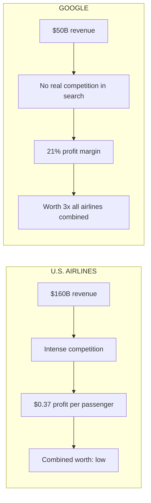
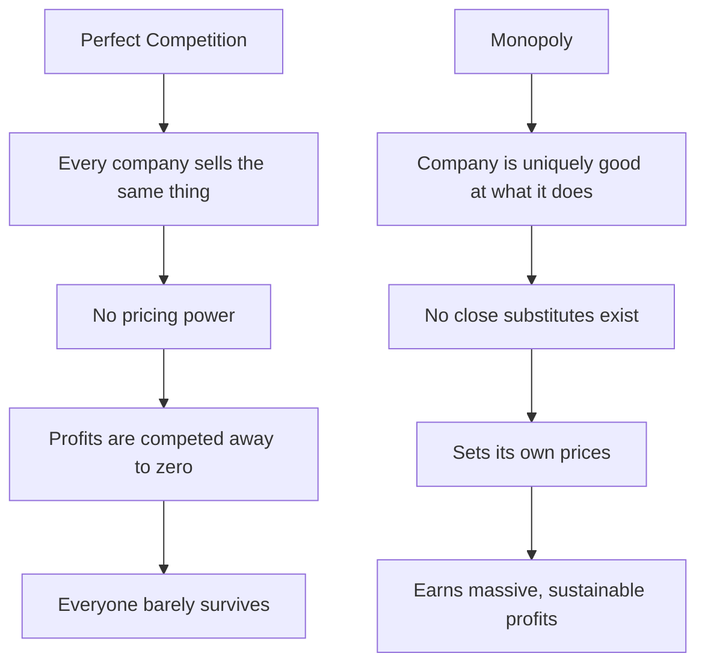
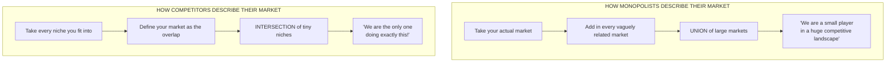
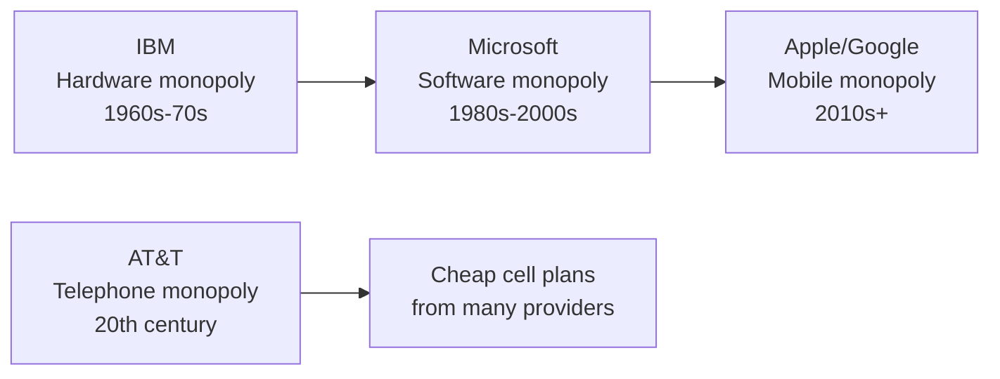
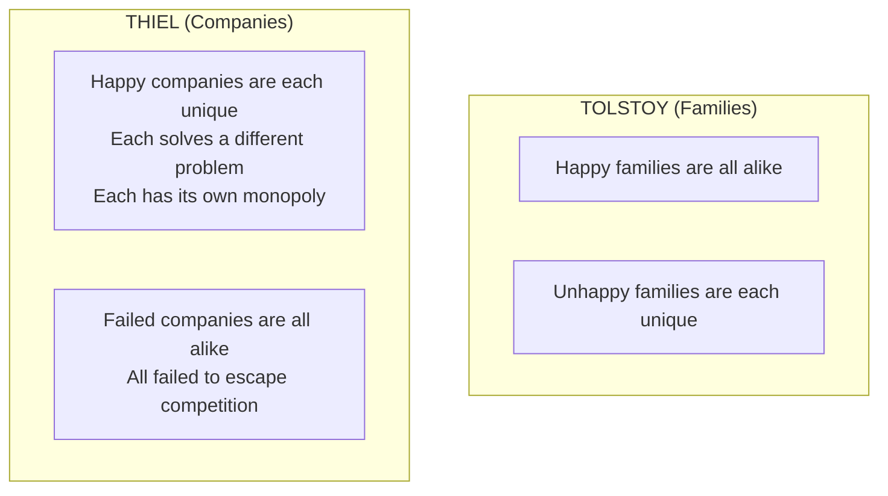

# Chapter 3: All Happy Companies Are Different

## The Big Idea in One Line

There are only two kinds of businesses in the world: **monopolies** (which are wildly profitable) and **competitive companies** (which struggle to survive). Every entrepreneur should aim to build a monopoly, not a slightly better competitor.

---

## The Business Version of the Contrarian Question

In Chapter 1, Thiel introduced the contrarian question: "What important truth do very few people agree with you on?" Now he reframes it for business:

> **"What valuable company is nobody building?"**

This is harder than it sounds, and for a sneaky reason. Your company could create a **lot of value** without becoming very **valuable** itself. Creating value is not enough. You also need to **capture** some of the value you create.

Think of it like baking bread for a village. You might feed 500 people every day. That is a lot of value. But if there are 20 other bakers in the village, all selling identical bread, you will be forced to sell at razor-thin margins. You created enormous value, but you captured almost none of it.

---

## The Airlines vs. Google: A Tale of Two Businesses

Thiel uses a devastating comparison to drive this point home.

### U.S. Airlines

- Serve millions of passengers every year.
- Create hundreds of billions of dollars of value annually.
- In 2012, the average airfare was $178 per trip.
- The airlines made only **37 cents per passenger trip** in profit.
- That is a profit margin so thin you could cut yourself on it.

### Google

- Brought in $50 billion in 2012 (compared to $160 billion for all airlines combined).
- Kept **21% of revenue as profit**.
- That is more than **100 times** the airline industry's profit margin.
- Google is worth more than every U.S. airline **combined**, three times over.

**Why the massive difference?** Airlines compete with each other on price, routes, and loyalty programs. They are all selling essentially the same thing: a seat on a plane from A to B. Google, on the other hand, has no real competitor in search. It stands alone.

---

## Two Models of Business: Perfect Competition vs. Monopoly

Economists use two simplified models to explain the difference between companies like airlines and companies like Google.

### Perfect Competition

Think of a farmer's market where ten people are selling identical tomatoes. That is perfect competition:

- Every seller offers the same product (homogeneous goods).
- No single seller has any power over the price. The market determines it.
- If profits appear, new sellers flood in, increase supply, and drive the price back down.
- If too many sellers enter, some go bankrupt, supply drops, and prices stabilize.
- In the long run, **no company makes an economic profit.** You earn just enough to survive, and nothing more.

It is like running on a treadmill. You are working incredibly hard, but you never actually move forward.

### Monopoly

A monopoly owns its market. It has no meaningful competitors, so it can set its own prices and produce at the quantity that maximizes profits.

**Thiel's definition of monopoly is specific and important:** he does not mean illegal bullies who crush competitors through dirty tricks, or companies that got government licenses. He means:

> **A company that is so good at what it does that no other firm can offer a close substitute.**

Google is the perfect example. It has not truly competed in search since the early 2000s, when it definitively pulled away from Microsoft and Yahoo.

### The Punchline That Sounds Insane (But Is True)

> **"Capitalism and competition are opposites."**

This is one of the most provocative lines in the book. Here is the logic:

- Capitalism is based on the accumulation of capital (wealth, profits).
- Under perfect competition, all profits get competed away.
- Therefore, **perfect competition is the enemy of capitalism**, not its friend.

Americans tend to mythologize competition and credit it with preventing socialist bread lines. But Thiel says that is a misunderstanding. The lesson for entrepreneurs is clear:

> **If you want to create and capture lasting value, do not build an undifferentiated commodity business.**

---

## Lies People Tell: How Both Sides Bend the Truth

Here is where the chapter gets really fun. Thiel reveals that our collective understanding of which companies are monopolies and which are competitive is **completely distorted**, because both sides lie.

### Monopoly Lies: "We are not a monopoly, we swear!"

Monopolists lie to protect themselves. If you brag about having a monopoly, you get audited, scrutinized, regulated, and attacked. So monopolists do everything they can to **hide** their dominance, usually by exaggerating the power of their (nonexistent) competition.

**The Google Example:**

Is Google a monopoly? It depends on how you define their market.

| How You Frame Google | Market Size | Google's Share | Verdict |
|---|---|---|---|
| Search engine | U.S. search market | **68%** (Microsoft ~19%, Yahoo ~10%) | Dominant monopoly |
| Advertising company | $495 billion global ad market | **3.4%** | Tiny player |
| Technology company | $964 billion global consumer tech | **0.24%** | Irrelevant speck |

See what happened there? By framing itself as "a technology company" instead of "a search engine," Google transforms from an overwhelming monopolist into a small fish in a gigantic pond.

The word "google" is literally in the Oxford English Dictionary as a verb. Nobody says "let me Bing that." But by describing their market as broadly as possible, Google avoids all sorts of unwanted attention.

**The trick monopolists use:** They describe their market as the **union** of several large markets, making themselves look small.

> Search engine + mobile phones + wearable computers + self-driving cars = "Look how competitive our industry is!"

Think of it like a sumo wrestler stepping on a scale that also weighs the entire stadium. "See? I am only 0.003% of the total weight in this building. I am tiny!"

### Competitive Lies: "We are in a league of our own!"

Non-monopolists tell the opposite lie. They desperately want to believe that they are special and unique, so they describe their market as **narrowly** as possible to make it look like they dominate.

**The British Restaurant Example:**

Suppose you want to open a restaurant that serves British food in Palo Alto. You might reason: "Nobody else is doing this. We will own the entire market!"

But that is only true if the relevant market is "British food in Palo Alto." What if the actual market is all restaurants in Palo Alto? What if it includes restaurants in nearby towns too?

The uncomfortable truth is that you have a strong incentive **not to ask these questions.** When you hear that most new restaurants fail within one or two years, your instinct is to come up with a story about how yours is different. You spend energy convincing people you are exceptional instead of seriously considering whether that is actually true.

**The trick non-monopolists use:** They describe their market as the **intersection** of several small niches, making themselves look unique.

> British food + restaurant + Palo Alto = "We are the only one!"

It is like saying "I am the tallest left-handed redhead in this specific building." Sure, technically you are unique. But that does not mean there is a market for it.

**The Movie Script Example:**

A screenwriter pitches: "This film combines various exciting elements in entirely new ways." Suppose her idea is to have Jay-Z star in a cross between Hackers and Jaws: rap star joins elite group of hackers to catch the shark that killed his friend.

That has definitely never been done before. But like the lack of British restaurants in Palo Alto, maybe that is a good thing.

### The PayPal vs. Castro Street Restaurants Comparison

In 2001, Thiel and his PayPal coworkers would get lunch on Castro Street in Mountain View. They had their pick of restaurants: Indian, sushi, burgers, and then sub-categories within those (North Indian vs. South Indian, cheaper vs. fancier).

In contrast, PayPal was at that time **the only email-based payments company in the world.** It employed fewer people than the restaurants on Castro Street did. But PayPal's business was **much more valuable than all of those restaurants combined.**

Starting a new South Indian restaurant is a really hard way to make money. If you lose sight of competitive reality and focus on trivial differentiating factors ("my naan is superior because of my great-grandmother's recipe"), your business is unlikely to survive.

---

## Ruthless People: The Human Cost of Competition

The problems with competitive businesses go far beyond just low profits. Competition makes people miserable.

### What Competition Does to Small Businesses

Imagine running one of those restaurants in Mountain View:

- You are not meaningfully different from dozens of competitors.
- You fight hard to survive every single day.
- If you offer affordable food with low margins, you can probably only pay employees minimum wage.
- You squeeze out every possible efficiency: Grandma works the register, the kids wash dishes in the back.
- Every waking moment is consumed by the struggle to not go under.

### What Competition Does Even at the Top

Even at the highest levels, competition is brutal. Thiel brings up the Michelin star system for restaurants, which enforces a culture of intense, soul-crushing competition among chefs.

French chef Bernard Loiseau, winner of three Michelin stars, was quoted as saying: "If I lose a star, I will commit suicide." Michelin maintained his rating, but Loiseau killed himself anyway in 2003 when a competing French dining guide downgraded his restaurant.

The competitive ecosystem pushes people toward ruthlessness or death. That is not a metaphor. It is literally what happened.

### What Monopoly Makes Possible

A monopoly like Google is different. Since it does not have to worry about competing with anyone, it has wider latitude to:

- **Care about its workers** (famously good perks, compensation, work environment)
- **Care about its products** (invest in long-term quality, not just short-term survival)
- **Care about its impact on the wider world** (Google's "Don't be evil" motto)

Thiel's key insight:

> **"In business, money is either an important thing or it is everything."**

- **Monopolists** can afford to think about things other than making money.
- **Non-monopolists** cannot. Every ounce of attention goes to today's margins and tomorrow's survival.

In perfect competition, a business is so focused on surviving today that it cannot possibly plan for the long term. Only one thing can allow a business to transcend the daily brute struggle for survival: **monopoly profits.**

Think of it like the difference between treading water and swimming. When you are treading water, all your energy goes to just keeping your head above the surface. You cannot think about where you want to go or enjoy the scenery. You are just trying not to drown. But if you are standing on a boat (monopoly), you can look around, chart a course, and actually go somewhere meaningful.

---

## Monopoly Capitalism: Are Monopolies Bad for Society?

This is the section where Thiel addresses the elephant in the room. Everyone has been taught that monopolies are bad. So is Thiel wrong to champion them?

### The Old Argument Against Monopolies

In a **static** world where nothing ever changes, monopolies are indeed bad. A monopolist in a static world is just a **rent collector**. They corner the market, jack up prices, and extract wealth from everyone else.

Thiel uses the board game Monopoly (the actual game) as a perfect metaphor. Deeds are shuffled from player to player, but the board never changes. There is no way to win by inventing a better kind of real estate. The values are fixed forever. All you can do is buy up properties and charge people to land on them.

In this static world, monopolies deserve their bad reputation.

### But We Live in a Dynamic World

The real world is not a static game board. It is possible to **invent new and better things.** And this changes the entire equation.

**Creative monopolists** give customers **more choices**, not fewer. They add entirely new categories of abundance to the world. Apple did not take away people's existing phones. It created a smartphone so good that people were happy to pay premium prices for something that had not existed before. That is not artificial scarcity. That is **created abundance.**

### The Cycle of Creative Monopolies

Old monopolies do not strangle innovation. They get **replaced** by new monopolies that are even better:

The history of progress is not a history of competition making things better. It is a history of **better monopoly businesses replacing incumbents.**

### Why Monopolies Drive Innovation (Not Hinder It)

1. **The profit incentive:** The promise of years or even decades of monopoly profits provides a powerful incentive to innovate in the first place. If you knew that any innovation would be instantly copied and competed away, why would you bother?

2. **The funding advantage:** Monopoly profits enable companies to make long-term plans and finance ambitious research projects that firms locked in competition could never afford. When you are struggling to survive, you cannot invest in moonshots.

Even the government implicitly agrees with this logic. One department (the Patent Office) works hard to **create** monopolies by granting patents to new inventions. Another department (the DOJ's antitrust division) works hard to **break up** monopolies. The tension between these two is not a contradiction. It is a recognition that creative monopolies are valuable, while rent-seeking monopolies are harmful.

---

## Why Economists Get This Wrong

Thiel has a fascinating explanation for why mainstream economics is so obsessed with competition as an ideal state, even though monopolies are clearly more desirable for entrepreneurs:

**Economists copied their math from 19th-century physics.** They see individuals and businesses as interchangeable atoms, not as unique creators. Their theories describe a state of perfect competition (equilibrium) because **that is what is easy to model mathematically**, not because it represents the best of business.

And here is the kicker. The long-run equilibrium predicted by 19th-century physics was a state in which all energy is evenly distributed and everything comes to rest. Physicists call this the **heat death of the universe.** Everything reaches the same temperature. All motion stops. Nothing happens anymore. Ever.

That is what perfect competition is in business. Everything evens out. Nobody makes money. Nothing new gets created. Everything reaches the same level of mediocrity. Equilibrium means stasis. And stasis means death.

> **"If your industry is in a competitive equilibrium, the death of your business won't matter to the world; some other undifferentiated competitor will always be ready to take your place."**

Think about how depressing that is. In a perfectly competitive market, you are so interchangeable that the world literally would not notice if your business disappeared tomorrow. Someone identical would fill the gap instantly.

Every new creation takes place **far from equilibrium.** Every successful business is successful exactly to the extent that it does something others cannot.

---

## The Chapter Title Explained

The chapter title is a play on the opening line of Tolstoy's *Anna Karenina*:

> "All happy families are alike; each unhappy family is unhappy in its own way."

Thiel flips this on its head for business:

> **"All happy companies are different: each one earns a monopoly by solving a unique problem. All failed companies are the same: they failed to escape competition."**

This is the opposite of Tolstoy. In families, happiness looks the same and unhappiness is unique. In business, **success is unique and failure looks the same.** Every successful company found its own path to dominance by solving a problem nobody else could solve. Every failed company died in the same way: drowning in a sea of competitors, unable to differentiate, unable to earn profits, unable to invest in the future.

---

## Key Takeaways from Chapter 3

1. **Creating value and capturing value are different things.** Airlines create enormous value but capture almost none. Google creates less total value but captures a huge percentage. The difference is monopoly vs. competition.

2. **Capitalism and competition are opposites.** This sounds shocking, but the logic is airtight. Capitalism is about accumulating capital (profits). Perfect competition eliminates all profits. Therefore, the most capitalist thing you can do is build a monopoly.

3. **Both monopolists and competitors lie about their markets.** Monopolists frame their market as a union of many large markets to look small. Competitors frame their market as an intersection of tiny niches to look unique. Understanding these distortions is crucial for seeing business reality clearly.

4. **Competition makes people miserable.** It is not just about low profits. It pushes people toward ruthlessness, burnout, and despair. From minimum-wage restaurant workers to Michelin-starred chefs who commit suicide, competition extracts a terrible human cost.

5. **Monopolies are good for society (in a dynamic world).** Creative monopolists add new categories of abundance. Old monopolies get replaced by better ones. The promise of monopoly profits incentivizes innovation. The profits themselves fund future innovation. The cycle is virtuous, not vicious.

6. **Equilibrium is death.** Economists worship competitive equilibrium because it is easy to model, not because it is desirable. In reality, equilibrium in business means stasis, undifferentiation, and irrelevance. Every great business operates far from equilibrium.

7. **All happy companies are different.** Each successful company earns a monopoly by solving a unique problem that no one else can solve. All failed companies are the same: they all drowned in competition. Your job as an entrepreneur is to find your unique monopoly.
