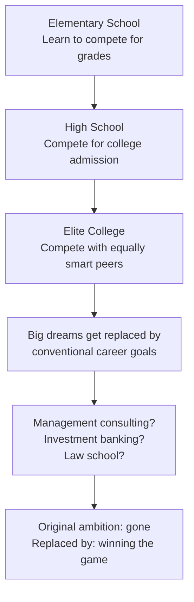
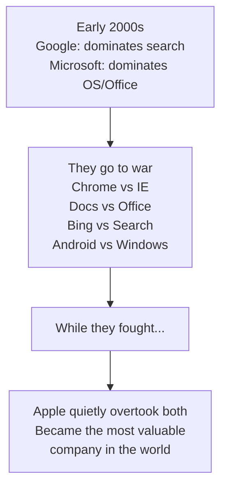
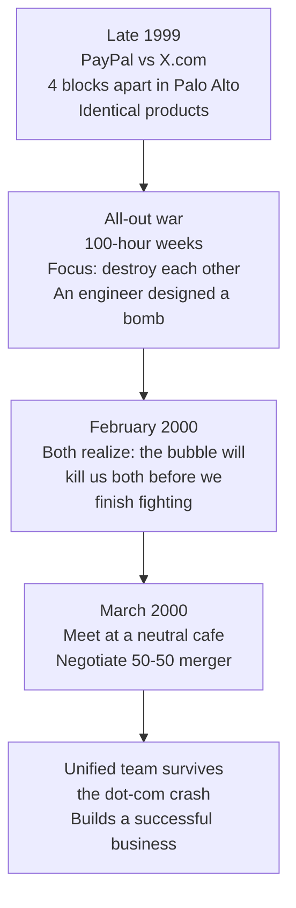
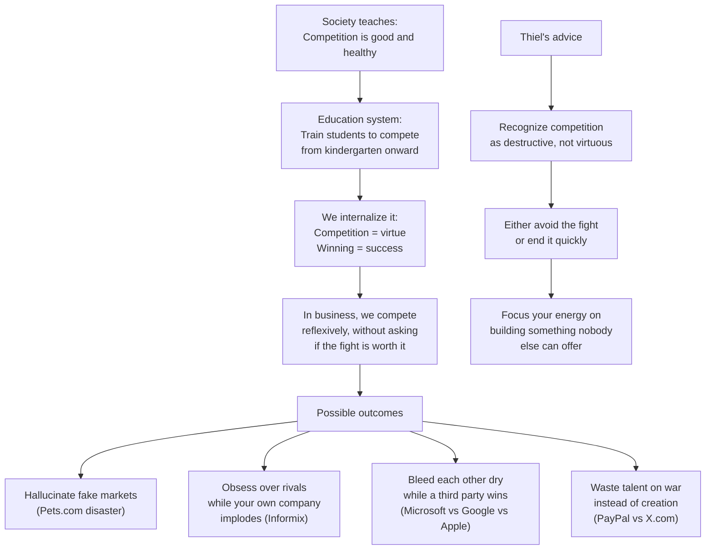

# Chapter 4: The Ideology of Competition

## The Big Idea in One Line

Competition is not a sign of health or virtue. It is an **ideology** that society has brainwashed us into worshipping, and the more we compete, the less we actually gain.

---

## Competition is Not Just an Economic Concept

Chapter 3 showed us *why* monopolies are better than competitive businesses (more profits, more freedom, more innovation). Chapter 4 goes deeper and asks a different question: **if competition is so bad, why does everyone believe in it so fiercely?**

Thiel's answer is startling. Competition is not just an economic reality that businesses have to deal with. It is an **ideology**. In fact, he calls it *the* ideology of modern society. We preach it. We internalize its necessity. We enact its commandments. And as a result, we trap ourselves within it, even though the more we compete, the less we gain.

Think of competition like a religion. Nobody questions it. Nobody asks whether it is actually true. Everyone just accepts that competition is healthy, natural, and good, the way people once accepted that the Earth was the center of the universe. Questioning competition feels almost heretical.

But Thiel wants you to question it.

---

## How the Education System Programs Us to Compete

The ideology of competition does not start in business. It starts much earlier. It starts in **school.**

### The Competition Machine

Our educational system is essentially a competition machine:

- **Grades** exist to measure each student's competitiveness with precise numerical scores.
- Students with the highest marks receive **status and credentials** as their reward.
- Every student is taught the **same subjects in the same ways**, regardless of individual talents and preferences.
- Students who do not learn well by sitting still at a desk are made to feel **inferior**.
- Students who excel at tests and assignments end up **defining their entire identity** in terms of this weird, artificial, academic parallel reality.

Think of it like training dogs for a show. Every dog is judged on the same criteria: how well they sit, stay, roll over, and walk on a leash. The dog that is an incredible swimmer or a natural tracker gets marked down because those skills are not on the rubric. The system does not measure what you are good at. It measures how well you conform to a standardized set of expectations.

### The Tournament Gets Worse as You Rise

And it gets worse the higher you climb:

1. **High school:** You compete for grades and test scores to get into a good college.
2. **College:** You compete with equally smart peers for the best grades and the most prestigious internships.
3. **Elite universities:** People who had big plans and wild ambitions in high school get **stuck in fierce rivalries** with equally talented peers over conventional careers like management consulting and investment banking.

By the time students reach the top, they have been so thoroughly trained to compete that they have forgotten why they started competing in the first place. The original dream ("I want to change the world") has been replaced by the game ("I need to beat the person next to me").

> For the privilege of being turned into conformists, students (or their families) pay **hundreds of thousands of dollars** in skyrocketing tuition that continues to outpace inflation. Why are we doing this to ourselves?

**The analogy:** It is like a poker tournament where the blinds keep going up. At first, everyone has big stacks and plays creatively. But as the tournament progresses, everyone becomes more conservative, more risk-averse, more focused on just surviving to the next round. By the final table, nobody is playing to win anymore. They are just trying not to lose. Education does the same thing to human ambition.

---

## Thiel's Personal Story: The Law School Trap

Thiel does not just lecture about this from a distance. He shares his own story, and it is remarkably honest.

### The Track

His path was so predictable that in his 8th-grade yearbook, a friend accurately predicted that four years later he would enter Stanford as a sophomore. And that is exactly what happened:

- Conventionally successful undergraduate career at Stanford.
- Enrolled at Stanford Law School.
- Competed even harder for the standard badges of success.

### The Prize

The highest prize in a law student's world is unambiguous: a **Supreme Court clerkship**. Out of tens of thousands of law graduates each year, only a few dozen get one. It is the ultimate badge of having "won" the game.

Thiel got close. After clerking on a federal appeals court for a year, he was invited to interview for a clerkship with Justices Anthony Kennedy and Antonin Scalia. He did not get the job.

### The Twist

At the time, it felt devastating. He had lost the final round of the competition he had been training for his entire life. But looking back, he realized it was one of the best things that ever happened to him.

> If he had gotten the clerkship, he would have spent years on a prestigious but narrow career path. Instead, the rejection pushed him out of the competition entirely, which eventually led him to co-found PayPal and then become one of the most successful investors in Silicon Valley.

Think of it like a marathon runner who trips and falls at mile 20. In the moment, it feels like a catastrophe. But what if falling out of the race forces you to look up and realize that the marathon was going in the wrong direction, and the finish line you actually wanted was somewhere else entirely?

**The lesson:** Winning a fiercely competitive game often means winning a prize that was not worth fighting for in the first place. Sometimes the best thing that can happen to you is **losing** the competition, because it forces you to stop playing someone else's game and start building your own.

---

## War and Peace: When Competition Becomes War

Thiel draws an explicit parallel between business competition and actual war. The connection is not just metaphorical. We literally use **war language** to describe business:

- We talk about "headhunters" and "sales forces" and "captive markets."
- We say companies have "war chests" and use "killer apps."
- We describe markets as "battlegrounds."

But Thiel's point goes beyond metaphor. He argues that **competition can escalate to the point where it becomes indistinguishable from war**, and at that point, everyone loses.

### Microsoft vs. Google: The War That Destroyed Value

Thiel uses the Microsoft vs. Google rivalry of the 2000s and 2010s as a cautionary tale.

In the early 2000s, both companies were in very different businesses:

- **Microsoft** dominated operating systems and office software.
- **Google** dominated search.

They could have stayed in their respective lanes and been incredibly profitable. Instead, they went to war:

| Google Attacked Microsoft | Microsoft Attacked Google |
|---|---|
| Chrome (vs. Internet Explorer) | Bing (vs. Google Search) |
| Google Docs (vs. Microsoft Office) | |
| Android (vs. Windows) | |
| Chromebook (vs. Windows PCs) | |
| Nexus phones (vs. Surface) | |

The result? While Microsoft and Google were busy fighting each other, **Apple** quietly overtook them both. Apple surged past both companies in market value, becoming the most valuable company in the world.

Think of it like two boxers who are so focused on punching each other that neither of them notices the referee raising a third fighter's hand in victory. While Google and Microsoft were locked in combat, Apple walked away with the championship belt.

### The Pets.com Disaster: Hallucinated Competition

Competition can make people **hallucinate opportunities where none exist.**

In the late 1990s, there was a fierce battle for the online pet store market:

- Pets.com vs. PetStore.com vs. Petopia.com vs. what seemed like dozens of others.

Each company was obsessed with defeating its rivals, precisely because there were **no substantive differences** to focus on. They competed on who could price chewy dog toys most aggressively and who could create the best Super Bowl ads.

But amid all this tactical fighting, **they completely lost sight of the bigger question**: was the online pet supply market even the right space to be in?

> **"Winning is better than losing, but everybody loses when the war is not one worth fighting."**

When Pets.com folded after the dot-com crash, $300 million of investment capital disappeared with it.

Think of it like three people fighting over who gets to sit in a particular chair, only to discover that the chair is on the Titanic. The question was never "who gets the chair?" The question was "why are you on this ship?"

---

## The Oracle vs. Informix Billboard War: When Rivalry Becomes Absurd

This is one of the most entertaining stories in the entire book. It shows what happens when competitive rivalry goes completely off the rails.

### The Setup

**Larry Ellison**, co-founder and CEO of Oracle, had a theory that it is always good to have an enemy. The enemy should be large enough to appear threatening (which motivates your employees) but not so large as to actually threaten your company.

### The Billboards

In 1996, a small database company called **Informix** put up a billboard near Oracle's Redwood Shores headquarters:

> **"CAUTION: DINOSAUR CROSSING"**

Another Informix billboard on northbound Highway 101 read:

> **"YOU'VE JUST PASSED REDWOOD SHORES. SO DID WE."**

Oracle shot back with a billboard implying Informix's software was slower than snails. Then Informix CEO **Phil White** escalated further. When he learned that Ellison enjoyed Japanese samurai culture, White commissioned a billboard depicting the Oracle logo alongside a broken samurai sword. This was not even aimed at Oracle as a company. It was a personal attack on Ellison.

### The Punchline

While Phil White was busy creating billboards, **Informix imploded** in a massive accounting scandal. White soon found himself **in federal prison** for securities fraud.

The lesson could not be clearer: while he was obsessing over his rivalry with Oracle, his own house was burning down. Competition had become such an all-consuming distraction that he literally lost sight of running his own company.

---

## The Larry Ellison vs. Tom Siebel Feud: Mirror Image Rivalry

Thiel shares another Oracle story to illustrate a different dimension of competition: **people who are so similar that they become bitter rivals.**

**Tom Siebel** was a top salesman at Oracle and Ellison's protege before he left to found Siebel Systems in 1993. Ellison saw this as betrayal. Siebel hated being in the shadow of his former boss.

The irony? The two men were basically identical. Both were hard-charging Chicagoans who loved to sell and hated to lose. And because they were so similar, their hatred ran deep.

They spent the second half of the 1990s trying to sabotage each other. At one point, Ellison sent **truckloads of ice cream sandwiches** to Siebel's headquarters to try to convince Siebel employees to jump ship. The copy on the wrappers read: "Summer is near. Oracle is here. To brighten your day and your career."

Think of it like two siblings who are so similar that they cannot stand each other. They fight precisely because they see too much of themselves in the other person. The closer the resemblance, the more intense the rivalry.

This is a pattern Thiel sees everywhere. The fiercest competition often happens between companies (and people) that are the **most similar**, not the most different. The differences are small, which makes the fight feel personal and all-consuming.

---

## The Asperger's Advantage

This is one of the more provocative observations in the chapter. Thiel notes that the hazards of imitative competition may partially explain why people with **Asperger's-like social ineptitude** seem to have an advantage in Silicon Valley.

The logic:

1. If you are **less sensitive to social cues**, you are less likely to do the same things as everyone else around you.
2. If you are genuinely interested in making things or programming, you will pursue those activities **single-mindedly** and become incredibly good at them.
3. When you apply your skills, you are a little less likely to **give up your own convictions**, which saves you from getting caught up in crowds competing for obvious prizes.

Think of it like being naturally immune to peer pressure. Most people look around the room and unconsciously adjust their behavior to match the crowd. But if you are the kind of person who genuinely does not notice or care what everyone else is doing, you are free to follow your own path. And in business, that path often leads somewhere more valuable than where the crowd is heading.

This is not a statement about neurodiversity being better or worse. It is an observation about how the competitive instinct, which is fundamentally a **social** instinct, can blind people to genuinely original opportunities.

---

## The PayPal vs. X.com Story: When Merging Beats Fighting

Thiel closes the chapter with his most personal example of competition gone wrong, and how he escaped it.

### The War

In 1998, Thiel co-founded **Confinity** (which became PayPal) with Max Levchin. In late 1999, they released the PayPal product. Almost immediately, **Elon Musk's X.com** was right on their heels:

- The two companies' offices were **four blocks apart** on University Avenue in Palo Alto.
- X.com's product mirrored PayPal's features feature-for-feature.
- By late 1999, they were in all-out war.

The intensity was insane:

- Many PayPal employees logged **100-hour workweeks.**
- The focus was not on objective productivity. It was on **defeating X.com.**
- One engineer actually **designed a bomb** for this purpose. When he presented the schematic at a team meeting, calmer heads prevailed. The proposal was attributed to extreme sleep deprivation.

Let that sink in. The rivalry had become so consuming that a sleep-deprived engineer thought building a literal explosive device was a reasonable response to a business competitor.

### The Peace

In February 2000, Thiel and Musk both realized something more important: the tech bubble was about to pop. A financial crash would destroy both companies before they could finish their fight. The bubble was a bigger threat than each other.

So in early March, they met on neutral ground (a cafe almost exactly equidistant from their offices) and negotiated a **50-50 merger.**

De-escalating the rivalry after the merger was not easy. But as problems go, it was a good one to have. As a unified team, they rode out the dot-com crash and built a successful business.

### The Rule

Thiel distills this into a clear rule for when you face competition:

> **"Sometimes you do have to fight. Where that is true, you should fight and win. There is no middle ground: either do not throw any punches, or strike hard and end it quickly."**

The worst possible outcome is a prolonged, grinding war where both sides bleed resources for years. Either avoid the fight entirely (by merging, differentiating, or walking away) or end it decisively and fast.

---

## The Hamlet Warning: Fighting for an Eggshell

Thiel ends with a quote from Shakespeare's Hamlet:

> *"Rightly to be great / Is not to stir without great argument, / But greatly to find quarrel in a straw / When honor's at the stake."*

For Hamlet, greatness means willingness to fight for reasons as thin as an eggshell. Anyone would fight for things that matter. True heroes take their personal honor so seriously they will fight for things that **do not matter.**

Thiel acknowledges that this twisted logic is part of human nature. We are wired to defend our honor, to prove we are tougher than the other guy, to never back down. But in business, this instinct is **disastrous.**

Think of two rams butting heads on a mountainside. From an evolutionary standpoint, it makes sense: they are fighting for mates. But from a business standpoint, they are just giving each other concussions while the grass grows greener on a completely different mountain that neither of them is looking at.

> **"If you can recognize competition as a destructive force instead of a sign of value, you are already more sane than most."**

---

## The Competitive Trap: A Visual Summary

---

## Key Takeaways from Chapter 4

1. **Competition is an ideology, not a natural law.** We have been trained from childhood to believe that competition is healthy and virtuous. But Thiel argues that this belief is a cultural artifact, not an objective truth. The more we compete, the less we gain.

2. **The education system is a competition machine.** From grades to college admissions to prestigious career tracks, the system progressively narrows people's ambitions until they are fighting fiercely for prizes they never actually wanted. Many people's biggest dreams get beaten out of them by the time they reach adulthood.

3. **Losing a competition can be the best thing that happens to you.** Thiel's own rejection from a Supreme Court clerkship pushed him out of the legal track and onto the path that led to PayPal. Sometimes not getting what you think you want is what frees you to pursue what you actually need.

4. **Similar people and companies fight the hardest.** The fiercest rivalries happen between near-identical competitors (Ellison vs. Siebel, PayPal vs. X.com). The smaller the actual differences, the more intense and personal the conflict becomes. This is irrational but deeply human.

5. **Competition can make you hallucinate opportunities.** The Pets.com story shows how competitive dynamics can cause people to fight over markets that are not even worth winning. "Winning is better than losing, but everybody loses when the war is not one worth fighting."

6. **Competition distracts you from what actually matters.** Informix's CEO was so busy creating billboards to insult Oracle that his company imploded from an accounting scandal. Microsoft and Google were so busy attacking each other that Apple overtook them both.

7. **If you must fight, fight to win quickly. Otherwise, do not fight at all.** The PayPal-X.com merger shows that sometimes the smartest move is to recognize your rival and join forces instead of bleeding each other dry. There is no middle ground: either avoid the fight or end it decisively.

8. **Being less socially attuned can be a superpower.** People who are less sensitive to social cues are less likely to get swept up in competitive herd behavior. This can free them to pursue genuinely original paths that the crowd overlooks.
