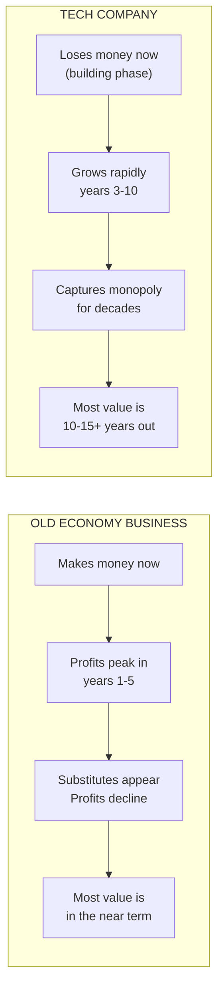
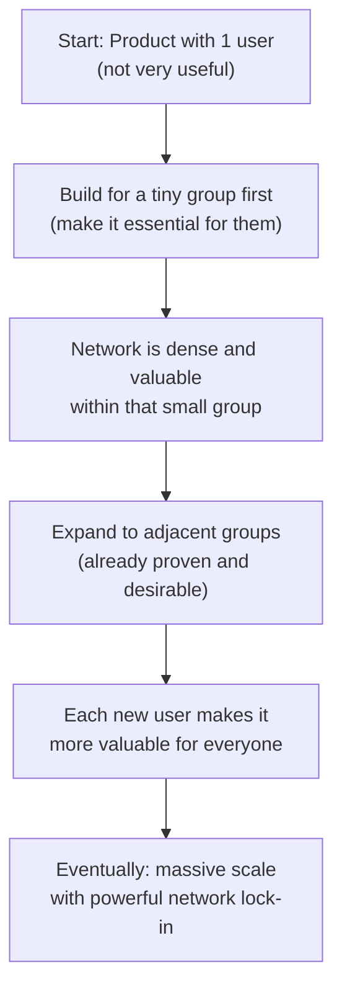
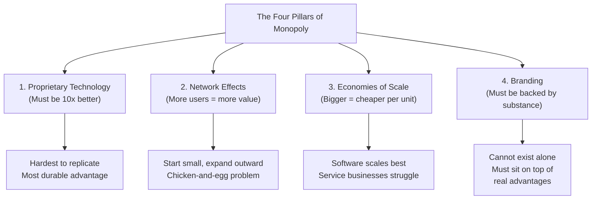
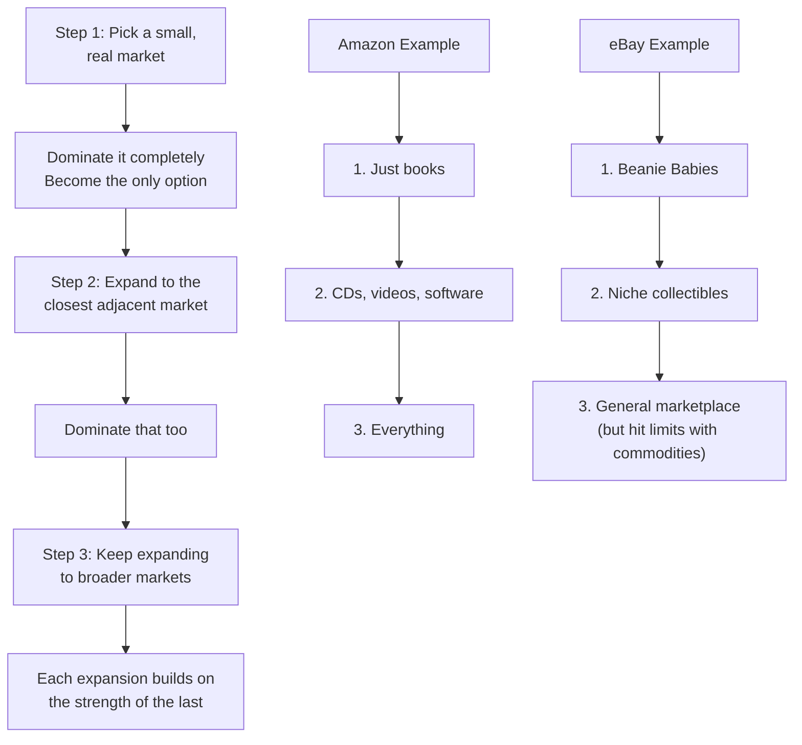
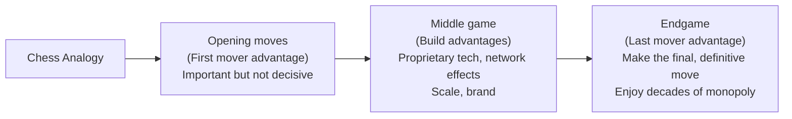

# Chapter 5: Last Mover Advantage

## The Big Idea in One Line

Being the first to enter a market means nothing if someone else comes along and takes it from you. What matters is being the **last mover**: making the final, definitive development in a market and then enjoying years or decades of monopoly profits.

---

## It Is Not About Who Gets There First

Everyone has heard of "first mover advantage." The idea is simple: if you enter a market first, you can lock in customers and build a lead before competitors even get started. It sounds compelling.

But Thiel says this is **a tactic, not a goal.** Moving first does not do you any good if someone else comes along and unseats you later.

Think of it like planting a flag on an island. Being the first person to plant a flag is meaningless if a bigger, better-equipped expedition shows up next month and builds a fortress. What matters is not who arrives first, but **who is still standing at the end.**

> **"It is much better to be the last mover: to make the last great development in a specific market and enjoy years or even decades of monopoly profits."**

The chapter title is a play on a biblical phrase ("the last shall be first"), and Thiel uses it to flip conventional startup wisdom on its head.

---

## The Real Measure of a Business: Future Cash Flows

Before diving into how to build a monopoly, Thiel establishes **what actually makes a business valuable.** This is important because many entrepreneurs get tricked by the wrong metrics.

### The Twitter vs. New York Times Comparison

Consider a surprising comparison:

| | New York Times | Twitter |
|---|---|---|
| **Employees** | A few thousand | A few thousand |
| **What they do** | Give millions of people news | Give millions of people news |
| **2012 profit** | $133 million | Lost money |
| **2013 valuation** | ~$2 billion | $24 billion |

Wait. The New York Times was profitable and Twitter was losing money. So why was Twitter valued at **12 times** the NYT's market cap?

### The Answer: It Is All About the Future

The value of a business today is the **sum of all the money it will make in the future**, discounted back to present value (since a dollar today is worth more than a dollar tomorrow).

- **Old Economy businesses** (like newspapers) earn most of their value in the near term. They might hold up for five or six years, but then substitutes appear and profits get competed away. They are like a candle that burns brightly now but will gutter out soon.
- **Technology companies** often lose money for the first few years, because it takes time to build valuable things. But most of their value comes from profits **10 to 15 years in the future.** They are like a seed that looks like nothing today but will grow into an enormous tree.

Investors valued Twitter at $24 billion because they expected it to capture monopoly profits over the coming decade. They valued the NYT at only $2 billion because newspapers' monopoly days were over.

### PayPal's Cash Flow Story

Thiel gives his own company as an example. In March 2001, PayPal had yet to make a profit, but revenues were growing 100% year over year. When he projected future cash flows, he found that **75% of the company's present value would come from profits generated in 2011 and beyond.** This was a company that had only been in business for 27 months.

And even that turned out to be an underestimation. PayPal continued to grow at about 15% annually, and today it appears that most of the company's value will come from 2020 and beyond.

LinkedIn tells a similar story. Its early revenue growth was modest, but as of early 2014, its market cap was $24.5 billion because the market believed in its long-term future.

### The Trap of Short-Term Metrics

Thiel warns against obsessing over short-term metrics. Many entrepreneurs get caught up in what he calls "measurement mania": they obsess over weekly active user statistics, monthly revenue numbers, and quarterly growth rates. These metrics feel scientific and rigorous, but they can be deeply misleading.

A startup with impressive short-term numbers but no path to durable monopoly is like a sprinter who runs a blazing first 100 meters but collapses at the halfway mark. The first 100 meters looked great. The race, however, was a marathon.

The question that actually matters is not "How fast are we growing this month?" but rather: **"Will this business still be around and generating cash flows in 10 to 20 years?"**

---

## Characteristics of Monopoly

This is the practical heart of the chapter. Thiel identifies **four key characteristics** that define durable monopolies. Every monopoly has some combination of these traits. If your business does not have at least one of them, you probably do not have a monopoly.

### 1. Proprietary Technology

This is the most substantive advantage a company can have because it makes your product **difficult or impossible to replicate.**

**The Rule of Thumb:** Your proprietary technology must be at least **10x better** than the closest substitute in some important dimension. Anything less than 10x will be perceived as marginal improvement and will be hard to sell.

**Why 10x?**

Think of it like this. If you open a new coffee shop and your coffee is 20% better than the place next door, most customers will not bother switching. The hassle of changing their routine is not worth a 20% improvement. But if your coffee is **10 times** better (or 10 times cheaper, or 10 times faster), people will beat down your door.

**Ways to achieve 10x improvement:**

| Method | Example |
|---|---|
| **Invent something completely new** | If you create something where nothing existed before, the improvement is theoretically infinite. PayPal made buying and selling on eBay at least 10x better than previous alternatives. |
| **Radically improve an existing solution** | Amazon offered at least 10x as many books as any physical bookstore. |
| **Superior integrated design** | Apple's iPad tablet design was a step-change improvement over anything that came before, integrating hardware and software in a way nobody else had matched. |

### 2. Network Effects

A product becomes more valuable as more people use it. This is a **network effect.**

**Examples:**
- A social network with one user is useless. With a million users, it is indispensable.
- A telephone is worthless if nobody else has one. It becomes more valuable with every new phone connected to the network.

**The Paradox of Network Effects:**

Network effects can be extremely powerful, but they present a chicken-and-egg problem. The product needs to be valuable to its very first users **before** the network is large. If it only becomes useful when millions of people join, those millions will never join because the product is not useful yet.

This means network-effect businesses must **start with especially small markets.** Facebook did not start as a social network for the entire world. It started as a tool for Harvard students only. At Harvard, the network was immediately dense and useful. Then it expanded to other Ivy League schools, then all colleges, then everyone.

Think of it like starting a fire. You do not light a match and throw it at a pile of wet logs. You start with a tiny ball of dry tinder, get that burning steadily, then add small sticks, then larger branches, and finally the logs. Every stage of the fire makes the next stage possible.

### 3. Economies of Scale

A monopoly business gets **stronger as it gets bigger.** Fixed costs (engineering, management, office space) get spread over a larger number of sales, so the cost per unit drops as volume increases.

**Why this matters for software especially:**

Software has enormous economies of scale because the marginal cost of producing another copy is nearly zero. It costs the same to run a piece of software whether it serves one customer or a million. This is fundamentally different from a service business like a yoga studio, where every new customer requires proportionally more instructor time, floor space, and scheduling.

**The contrast:**

- A **software company** can grow from 10 customers to 10 million without proportionally increasing its costs. The product stays the same. The servers scale. Revenue multiplies while costs barely budge.
- A **yoga studio** that doubles its customers needs to double its instructors, double its floor space, and double its schedule. Revenue doubles, but so do costs. There is no leverage.

Many businesses gain only limited advantages as they grow to large scale. Service businesses are especially hard to scale because they are inherently labor-intensive. If your business requires highly personalized human attention for every customer, you are going to hit a ceiling.

### 4. Branding

A strong brand is a powerful way to build a monopoly. The obvious example is **Apple.**

Apple's brand represents a promise: sleek design, premium quality, seamless integration between hardware and software. No other technology company can credibly make the same promise. And because consumers trust Apple's brand, they are willing to pay premium prices.

**But here is the trap:** Branding alone is not enough. You cannot build a monopoly on brand without substance.

Thiel points to companies that tried to copy Apple's branding strategy without having Apple's underlying strengths. They launched sleek stores, premium prices, and minimalist marketing. But without the technological superiority and integrated design that made Apple's brand credible in the first place, these copycat efforts fell flat.

Think of it like a person who buys an expensive suit and a fancy watch and expects to be treated like a CEO. The suit and watch look the part, but if you do not actually know how to run a company, people will see through the costume very quickly.

> **No technology company can be built on brand alone.** Brand is the outermost layer of the monopoly. The core must be substance: proprietary technology, network effects, or economies of scale.

---

## Building a Monopoly: The Playbook

Knowing the characteristics of a monopoly is one thing. Actually building one is another. Thiel lays out a concrete strategy.

### Step 1: Start Small and Monopolize

Every startup should begin with a **very small market.** This is counterintuitive. Most entrepreneurs dream of addressing billion-dollar markets from day one. But Thiel says this is backwards.

**Why start small?**

- A small market is easier to dominate. You can become the clear leader faster.
- It is easier to serve a concentrated group of customers well than to try to serve everyone.
- Monopoly in a small market gives you cash flow and credibility to expand.

**The analogy:** You are a general with a small army. Would you rather attack a small village and conquer it completely, or charge at a massive fortress and hope for the best? The smart general takes the village first, consolidates, builds strength, and then expands.

**The danger of going too small:**

The flip side is also true. You can pick a market that is **too** small, meaning it does not exist or is too tiny to sustain a business. Thiel's earlier example of a British restaurant in Palo Alto illustrates this perfectly. You might "own" the market for British food in Palo Alto, but that market might consist of approximately zero customers.

The perfect target market is **small but real.** A concentrated group of people who genuinely need what you are building and who are served by few or no alternatives.

### Step 2: Scale Up

Once you dominate a niche, expand gradually to related, slightly broader markets.

**The Amazon Story:**

Amazon is the textbook example of this strategy executed perfectly:

1. **Started with books.** Not all retail. Not even all media. Just books.
2. **Dominated online bookselling.** Became the go-to destination for anyone looking for a book, especially people far from a bookstore or looking for something unusual.
3. **Expanded to adjacent categories.** CDs, videos, and software first (the most similar markets to books).
4. **Continued adding categories gradually** until it became the world's general store.

Even the name was brilliant. "Amazon" originally reflected the biodiversity of the Amazon rainforest (cataloging every book in the world), and now it stands for every kind of thing in the world, period.

**The eBay Story:**

eBay followed the same pattern:

1. **Started with Beanie Baby collectors.** Not all online commerce. Just niche hobbyist auctions.
2. **Dominated the Beanie Baby trade** (the most intense interest group they could find).
3. **Expanded to other small-time hobbyists** and collectors.
4. **Eventually became the most reliable online marketplace** for trading almost anything.

But eBay also learned a hard lesson about the limits of scaling. The auction model works great for individually distinctive products (coins, stamps, vintage items) but not for commodities. Nobody wants to bid on pencils or tissues. For those, it is more convenient to just buy from Amazon. eBay is still a valuable monopoly, but it turned out to be smaller than people in 2004 expected.

> **"Sequencing markets correctly is underrated, and it takes discipline to expand gradually."**

The most successful companies make the core progression of dominating a specific niche and then scaling to adjacent markets a central part of their founding narrative.

### Step 3: Do Not "Disrupt"

This might be the most surprising piece of advice in the chapter. Silicon Valley is obsessed with the word "disruption." Everyone wants to be a disruptor. Thiel says this mindset is **dangerous.**

**What "disruption" originally meant:**

The term was coined by Harvard professor Clayton Christensen to describe a specific pattern: a firm uses new technology to introduce a low-end product at low prices, improves it over time, and eventually overtakes premium products from incumbent companies. PCs disrupting mainframes is the classic example. Mobile devices disrupting PCs is a more recent one.

**What "disruption" has become:**

The word has been hijacked. It became a self-congratulatory buzzword for anything posing as trendy and new. Every startup founder claims to be "disrupting" some industry, whether or not they actually are.

**Why the disruption mindset is harmful:**

1. **It defines you in relation to existing companies.** If you think of yourself as an insurgent battling dark forces, you become fixated on the obstacles in your path instead of the thing you are creating. If your company can be summed up by its opposition to an existing firm, it cannot be completely new, and it probably will not become a monopoly.

2. **It attracts unwanted attention and conflict.** "Disruptors" are people who look for trouble and find it. Think of Napster: the name itself meant trouble. The founders credibly threatened to disrupt the powerful music recording industry. They made the cover of Time magazine. A year and a half later, they were in bankruptcy court.

**The PayPal counterexample:**

PayPal could be seen as disruptive (it took some business away from Visa by popularizing internet payments). But PayPal did not try to directly challenge Visa. In fact, by expanding the overall market for payments, PayPal gave Visa **far more business** than it took away. The dynamic was net positive, unlike Napster's negative-sum war with the recording industry.

Think of it like the difference between two new restaurants opening on the same block. The first restaurant puts up a giant sign: "WE ARE HERE TO DESTROY THE RESTAURANT NEXT DOOR." That restaurant will spend its life fighting. The second restaurant quietly opens, serves amazing food, and attracts customers who would never have eaten out at all. Both the new restaurant and the existing one benefit. The first approach is disruption. The second approach is creation.

> **"As you craft a plan to expand to adjacent markets, do not disrupt: avoid competition as much as possible."**

---

## The Last Will Be First: The Chapter's Conclusion

Thiel ends with the chess analogy that gives the chapter its name.

Everyone focuses on the opening moves (first mover advantage). But grandmaster Jose Raul Capablanca said:

> **"To succeed, you must study the endgame before everything else."**

In chess, a strong opening is worthless if you do not know how to close out the game. The same is true in business:

- It does not matter if you were first to market if a competitor comes along and builds something better.
- What matters is making the **last great development** in a market, the move that establishes your position for years or decades.
- The way to do that is to **dominate a small niche and scale up from there**, building durable advantages (proprietary technology, network effects, economies of scale, branding) at every step.

Think of the difference between the tortoise and the hare, but with a twist. In Thiel's version, it is not about being slow. It is about understanding where the finish line actually is. The hare sprints to the first visible marker and celebrates. The tortoise studies the entire course, picks the right path, and reaches the real finish line, one that the hare did not even know existed.

---

## Key Takeaways from Chapter 5

1. **Being the last mover matters more than being the first.** First mover advantage is overrated. What counts is making the final, definitive development in a market and holding it for years. Study the endgame, not the opening.

2. **A business is worth the sum of all its future cash flows.** Short-term profits can be misleading. A company losing money today (like Twitter in 2013 or PayPal in 2001) can be far more valuable than a profitable one (like the New York Times) if its future cash flows will be much larger.

3. **Do not obsess over short-term metrics.** Weekly active users and monthly revenue are important, but they do not tell you whether the business will be durable. The real question is: will you still be generating cash flows in 10 to 20 years?

4. **Every durable monopoly shares some combination of four traits:**
   - **Proprietary technology** (at least 10x better than alternatives)
   - **Network effects** (product gets more valuable as more people use it)
   - **Economies of scale** (cost per unit drops as volume increases)
   - **Branding** (must be backed by real substance, not just marketing)

5. **Start small, dominate a niche, then expand.** Do not try to address a huge market from day one. Find a small group of customers with a real need, become their only option, then expand to adjacent markets. Amazon started with books. eBay started with Beanie Babies. Facebook started with Harvard.

6. **Sequence your market expansion carefully.** Expanding too fast or to the wrong adjacent markets can destroy you. Discipline and patience matter. Each new market should build logically on the last.

7. **Do not "disrupt."** The disruption mindset defines you in opposition to existing companies, attracts conflict, and prevents you from building something truly new. Focus on creating value, not on fighting incumbents. PayPal expanded the payments market; Napster tried to destroy the music industry. PayPal survived. Napster did not.

8. **Brand is important but not sufficient.** You cannot build a monopoly on brand alone. Brand is the outermost layer. The core must be genuine technological or structural advantages. A fancy suit does not make you a CEO.
